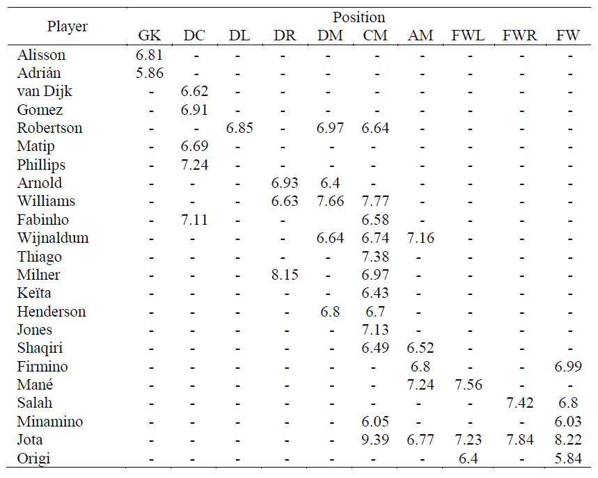

# Line-up optimization

The aim of this demo, developed by Aitzol Iturrospe, is to optimize the initial line-up of Liverpool FC. The goal is to select players
maximizing the sum of their ratings. Two different cases are considered: 
 - a 4-3-3 attack formation and 
 - a 4-2-3-1 medium defensive formation. 

The problem is stated as a binary quadratic model (BQM) and it is solved in a D-Wave Leap’s Hybrid Solver.

The eleven football players are divided into several positions in accordance with the team formation. In addition to one goalkeeper
(GK), the players are divided into three main positions, defenders (D), midfielders (M), and forward/strikers (FW). Each major position
can be subdivided into several more specific positions, such as
- central defender (DC),
- left wing defender (DL),
- right wing defender (DR),
- defensive midfielder (DM), 
- central midfielder (CM),
- attack midfielder (AM),
- right wing forward (FWR),
- left wing forward (FWL) or
- forward/striker (FW)

Figure 1 shows Liverpool FC football players’ ratings depending on the position as presented in the article (Mahrudinda et al., 2020) in
the English Premier League during the 2020/2021 season. Each pair (player, position) will be considered as a binary variable; being 1 if
the player is lined up to play in that position and 0 otherwise.


<p align="center" dir="auto">
</p><p dir="auto"></p>
<p dir="auto">
Fig.1 - Players’ ratings (Mahrudinda et al., 2020).
</p>
The objective function to be maximized is the total sum of ratings of selected players, subject to the constraints in table 1, and the specific contrantis for both formations considered in table 2 and table 3 respectively.

Maximize H<sub>Z</sub>=6.81x<sub>0</sub>+5.86x<sub>1</sub>+6.62x<sub>2</sub>+⋯+6.03x<sub>40</sub>+8.22x<sub>41</sub>+5.84x<sub>42</sub>

Equality constraints are standardly formulated in BQMs as minimizing (∑_(i=0)^N▒〖a_i x_i-b〗)^2 functions. Therefore, the constraints in table 1 and 2 are reformulated following then quadratic formulation and they are shown in tables 4, 5 and 6.

Table.1 - General constraints

Constraint  | Explanation  | Nomenclature
------------- | ------------- | -------------
(x<sub>0</sub>+x<sub>1</sub>+x<sub>2</sub>+⋯+x<sub>40</sub>+x<sub>41</sub>+x<sub>42</sub>-11)<sup>2</sup>  | 11 players  | C<sub>1</sub>
(x<sub>0</sub>+x<sub>1</sub>-1)<sup>2</sup>  | 1 goalkeeper  | C<sub>2</sub>
(x<sub>2</sub>+x<sub>3</sub>+x<sub>4</sub>+x<sub>5</sub>+x<sub>6</sub>-2)<sup>2</sup>  | 2 central defenders  | C<sub>3</sub>
(x<sub>7</sub>-1)<sup>1</sup>  | 1 left-hand side defender  | C<sub>4</sub>
(x<sub>8</sub>+x<sub>9</sub>+x<sub>10</sub>-1)<sup>2</sup>  | 1 right-hand side defender  | C<sub>5</sub>
(x<sub>38</sub>+x<sub>39</sub>+x<sub>40</sub>+x<sub>41</sub>+x<sub>42</sub>-1)<sup>2</sup>  | 1 forward/striker  | C<sub>6</sub>

Table.2 - Constraints for formation 4-3-3

Constraint  | Explanation  | Nomenclature
------------- | ------------- | -------------
(x<sub>16</sub>+x<sub>17</sub>+x<sub>18</sub>+⋯+x<sub>25</sub>+x<sub>26</sub>+x<sub>27</sub>-3)<sup>2</sup>  | 3 central midfielders  | C<sub>7</sub>
(x<sub>33</sub>+x<sub>34</sub>+x<sub>35</sub>-1)<sup>2</sup>  | 1 left forward  | C<sub>8</sub>
(x<sub>36</sub>+x<sub>37</sub>-1)<sup>2</sup>  | 1 right forward  | C<sub>9</sub>

Table.3 - Constraints for formation 4-3-2-1

Constraint  | Explanation  | Nomenclature
------------- | ------------- | -------------
(x<sub>11</sub>+x<sub>12</sub>+x<sub>13</sub>+x<sub>14</sub>+x<sub>15</sub>-2)<sup>2</sup>  | 2 defensive midfielders  | C<sub>10</sub>
(x<sub>28</sub>+x<sub>29</sub>+x<sub>30</sub>+x<sub>31</sub>+x<sub>32</sub>-3)<sup>2</sup>  | 3 attacking midfielder  | C<sub>11</sub>

For both formations, we impose the following inequalities as constraints to avoid solutions with players in multiple positions. For inequality constraints, slack variables are introduced in order to reduce them to equalities (DWAVE, 2021) (as shown in table 4).

Table 4. Constraints to avoid solutions where the same player plays in different positions

Constraint  | Nomenclature
------------- | -------------
(x<sub>7</sub>+x<sub>11</sub>+x<sub>16</sub>+a<sub>0</sub>-1)<sup>2</sup>  | I<sub>1</sub>
(x<sub>8</sub>+x<sub>12</sub>+a<sub>1</sub>-1)<sup>2</sup>  | I<sub>2</sub>
(x<sub>9</sub>+x<sub>13</sub>+x<sub>17</sub>+a<sub>2</sub>-1)<sup>2</sup>  | I<sub>3</sub>
(x<sub>14</sub>+x<sub>19</sub>+x<sub>28</sub>+a<sub>3</sub>-1)<sup>2</sup>  | I<sub>4</sub>
(x<sub>10</sub>+x<sub>21</sub>+a<sub>4</sub>-1)<sup>2</sup>  | I<sub>5</sub>
(x<sub>15</sub>+x<sub>23</sub>+a<sub>5</sub>-1)<sup>2</sup>  | I<sub>6</sub>
(x<sub>25</sub>+x<sub>29</sub>+a<sub>6</sub>-1)<sup>2</sup>  | I<sub>7</sub>
(x<sub>31</sub>+x<sub>33</sub>+a<sub>7</sub>-1)<sup>2</sup>  | I<sub>8</sub>
(x<sub>36</sub>+x<sub>39</sub>+a<sub>8</sub>-1)<sup>2</sup>  | I<sub>9</sub>
(x<sub>27</sub>+x<sub>32</sub>+x<sub>34</sub>+x<sub>37</sub>+x<sub>41</sub>+a<sub>9</sub>-1)<sup>2</sup>  | I<sub>10</sub>

As the objective function is a maximization function, it is converted to a minimization by multiplying the H<sub>Z</sub> expression by -1.

H<sub>433</sub> = -H<sub>Z</sub> + λ(C<sub>1</sub>+C<sub>2</sub>+C<sub>3</sub>+C<sub>4</sub>+C<sub>5</sub>+C<sub>6</sub>+C<sub>7</sub>+C<sub>8</sub>+C<sub>9</sub>+I<sub>1</sub>+I<sub>2</sub>+I<sub>3</sub>+I<sub>4</sub>+I<sub>5</sub>+I<sub>6</sub>+I<sub>7</sub>+I<sub>8</sub>+I<sub>9</sub>+I<sub>10</sub>)

H<sub>4321</sub> = -H<sub>Z</sub> + λ(C<sub>1</sub>+C<sub>2</sub>+C<sub>3</sub>+C<sub>4</sub>+C<sub>5</sub>+C<sub>6</sub>+C<sub>10</sub>+C<sub>11</sub>+I<sub>1</sub>+I<sub>2</sub>+I<sub>3</sub>+I<sub>4</sub>+I<sub>5</sub>+I<sub>6</sub>+I<sub>7</sub>+I<sub>8</sub>+I<sub>9</sub>+I<sub>10</sub>)


{'1 goal keeper': (True, 0.0),
'11 players team': (True, 0.0),
'x10+x21<=1': (True, 0.0),
'x14+x19+x28<=1': (True, 0.0),
'x15+x23<=1': (True, 0.0),
'x16+x17+x18+x19+x20+x21+x22+x23+x24+x25+x26+x27+=3': (True, 0.0),
'x2+x3+x4+x5+x6=2': (True, 0.0),
'x25+x29<=1': (True, 0.0),
'x27+x32+x34+x37+x41<=1': (True, 0.0),
'x31+x33<=1': (True, 0.0),
'x33+x34+x35=1': (True, 0.0),
'x36+x37=1': (True, 0.0),
'x36+x39<=1': (True, 0.0),
'x38+x39+x40+x41+x42=1': (True, 0.0),
'x7+x11+x16<=1': (True, 0.0),
'x7=1': (True, 0.0),
'x8+x12<=1': (True, 0.0),
'x8+x9+x10=1': (True, 0.0),
'x9+x13+x17<=1': (True, 0.0)}

   Variable     Player Position  Rating  Selected
0      x[0]    Alisson       GK    6.81         1
1      x[5]   Phillips       DC    7.24         1
2      x[6]    Fabinho       DC    7.11         1
3      x[7]  Robertson       DL    6.85         1
4     x[10]     Milner       DR    8.15         1
5     x[17]   Williams       CM    7.77         1
6     x[20]     Thiago       CM    7.38         1
7     x[27]       Jota       CM    9.39         1
8     x[33]       Mane      FWL    7.56         1
9     x[36]      Salah      FWR    7.42         1
10    x[38]    Firmino       FW    6.99         1
82.67


{'1 goal keeper': (True, 0.0),
'11 players team': (True, 0.0),
'x10+x21<=1': (True, 0.0),
'x11+x12+x13+x14+x15=2': (True, 0.0),
'x14+x19+x28<=1': (True, 0.0),
'x15+x23<=1': (True, 0.0),
'x2+x3+x4+x5+x6=2': (True, 0.0),
'x25+x29<=1': (True, 0.0),
'x27+x32+x34+x37+x41<=1': (True, 0.0),
'x28+x29+x30+x31+x32=3': (True, 0.0),
'x31+x33<=1': (True, 0.0),
'x36+x39<=1': (True, 0.0),
'x38+x39+x40+x41+x42=1': (True, 0.0),
'x7+x11+x16<=1': (True, 0.0),
'x7=1': (True, 0.0),
'x8+x12<=1': (True, 0.0),
'x8+x9+x10=1': (True, 0.0),
'x9+x13+x17<=1': (True, 0.0)}


   Variable     Player Position  Rating  Selected
   
0      x[0]    Alisson       GK    6.81         1

1      x[5]   Phillips       DC    7.24         1

2      x[6]    Fabinho       DC    7.11         1

3      x[7]  Robertson       DL    6.85         1

4     x[10]     Milner       DR    8.15         1

5     x[17]   Williams       CM    7.77         1

6     x[20]     Thiago       CM    7.38         1

7     x[27]       Jota       CM    9.39         1

8     x[33]       Mane      FWL    7.56         1

9     x[36]      Salah      FWR    7.42         1

10    x[38]    Firmino       FW    6.99         1

82.67

   Variable     Player Position  Rating  Selected
0      x[0]    Alisson       GK    6.81         1
1      x[5]   Phillips       DC    7.24         1
2      x[6]    Fabinho       DC    7.11         1
3      x[7]  Robertson       DL    6.85         1
4     x[10]     Milner       DR    8.15         1
5     x[13]   Williams       DM    7.66         1
6     x[15]  Henderson       DM    6.80         1
7     x[28]  Wijnaldum       AM    7.16         1
8     x[30]    Firmino       AM    6.80         1
9     x[31]       Mane       AM    7.24         1
10    x[41]       Jota       FW    8.22         1
80.03999999999999

  

QPU results for 4-3-3 formation 	Results for 4-3-3 formation in (Mahrudinda et al., 2020)

Binary variable  | Player Name  | Position  | Rating  | Binary variable  | Player Name  | Position  | Rating
------------- | ------------- | ------------- | ------------- | ------------- | ------------- | ------------- | -------------
x<sub>1</sub> | Alisson | GK | 6.81 | x<sub>1</sub> | Alisson | GK | 6.81 
x<sub>6</sub> | Philips | DC | 7.24 | x<sub>4</sub> | Gomez | DC | 6.91 
x<sub>7</sub> | Fabinho | DC | 7.11 | x<sub>6</sub> | Philips | DC | 7.24 
x<sub>8</sub> | Robertson | DL | 6.85 | x<sub>8</sub> | Robertson | DL | 6.85 
x<sub>11</sub> | Milner | DR | 8.15 | x<sub>11</sub> | Milner | DR | 8.15 
x<sub>18</sub> | Williams | CM | 7.77 | x<sub>18</sub> | Williams | CM | 7.77 
x<sub>21</sub> | Thiago | CM | 7.38 | x<sub>21</sub> | Thiago | CM | 7.38 
x<sub>28</sub> | Jota | CM | 9.39 | x<sub>28</sub> | Jota | CM | 9.39 
x<sub>34</sub> | Mane | FWL | 7.56 | x<sub>34</sub> | Mane | FWL | 7.56 
x<sub>37</sub> | Salah | FWR | 7.42 | x<sub>37</sub> | Salah | FWR | 7.42 
x<sub>39</sub> | Firminho | FW | 6.99 | x<sub>39</sub> | Firminho | FW | 6.99 
 |  |  | Max H<sub>Z</sub> | 82.67 |  |  |  	Max H<sub>Z</sub> | 82.47


Binary variable  | Player Name  | Position  | Rating  | Binary variable  | Player Name  | Position  | Rating
------------- | ------------- | ------------- | ------------- | ------------- | ------------- | ------------- | -------------
x<sub>1</sub> | Alisson | GK | 6.81 | x<sub>1</sub> | Alisson | GK | 6.81 
x<sub>6</sub> | Philips | DC | 7.24 | x<sub>6</sub> | Gomez | DC | 6.91 
x<sub>7</sub> | Fabinho | DC | 7.11 | x<sub>7</sub> | Philips | DC | 7.24 
x<sub>8</sub> | Robertson | DL | 6.85 | x<sub>8</sub> | Robertson | DL | 6.85 
x<sub>11</sub> | Milner | DR | 8.15 | x<sub>11</sub> | Milner | DR | 8.15 
x<sub>14</sub> | Williams | DM | 7.66 | x<sub>14</sub> | Williams | DM | 7.66 
x<sub>16</sub> | Henderson | DM | 6.80 | x<sub>16</sub> | Henderson | DM | 6.80 
x<sub>29</sub> | Wijnaldum | AM | 7.16 | x<sub>29</sub> | Wijnaldum | AM | 7.16
x<sub>31</sub> | Firminho | AM | 6.80 | x<sub>31</sub> | Firminho | AM | 6.80
x<sub>32</sub> | Mane | AM | 7.24 | x<sub>32</sub> | Mane | AM | 7.24 
x<sub>42</sub> | Jota | FW | 8.22 | x<sub>42</sub> | Jota | FW | 8.22
 |  |  | Max H<sub>Z</sub> | 80.04 |  |  |  	Max H<sub>Z</sub> | 80.04


Describe your example and specify what it is demonstrating. Consider the
following questions:

* Is it pedagogical or a usable application?
* Does it belong to a particular domain such as material simulation or logistics? 
* What level of Ocean proficiency does it target (beginner, advanced, pro)? 

A clear description allows us to properly categorize your example.

Images are encouraged. If your example produces a visualization, consider
displaying it here.


## Usage

A simple command that runs your program. For example,

```bash
python <demo_name>.py
```

If your example requires user input, make sure to specify any input limitations.

## Code Overview

A general overview of how the code works.

We prefer descriptions in bite-sized bullet points:

* Here's an example bullet point

## Code Specifics

Notable parts of the code implementation.

This is the place to:

* Highlight a part of the code implementation
* Talk about unusual or potentially difficult parts of the code
* Explain a code decision
* Explain how parameters were tuned

Note: there is no need to repeat everything that is already well-documented in
the code.

## References

A. Person, "Title of Amazing Information", [short link
name](https://example.com/)

## License

Released under the Apache License 2.0. See [LICENSE](LICENSE) file.
