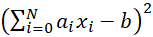

# Line-up optimization

The aim of this demo, developed by Aitzol Iturrospe, is to optimize the initial line-up of Liverpool FC. The goal is to select players
maximizing the sum of their ratings. Two different cases are considered: 
 - a 4-3-3 attack formation and 
 - a 4-2-3-1 medium defensive formation. 

The problem is stated as a binary quadratic model (BQM) and it is solved in a D-Wave Leap’s Hybrid Solver.

The eleven football players are divided into several positions in accordance with the team formation. In addition to one goalkeeper
(GK), the players are divided into three main positions, defenders (D), midfielders (M), and forward/strikers (FW). Each major position
can be subdivided into several more specific positions, such as
- central defender (DC),
- left wing defender (DL),
- right wing defender (DR),
- defensive midfielder (DM), 
- central midfielder (CM),
- attack midfielder (AM),
- right wing forward (FWR),
- left wing forward (FWL) or
- forward/striker (FW)

Figure 1 shows Liverpool FC football players’ ratings depending on the position as presented in the article (Mahrudinda et al., 2020) in
the English Premier League during the 2020/2021 season. Each pair (player, position) will be considered as a binary variable; being 1 if
the player is lined up to play in that position and 0 otherwise.

Fig.1 - Players’ ratings (Mahrudinda et al., 2020).

The objective function to be maximized is the total sum of ratings of selected players, subject to the constraints in table 1, and the specific constraints for both formations considered in table 2 and table 3 respectively.

Maximize HZ=6.81x0+5.86x1+6.62x2+⋯+6.03x40+8.22x41+5.84x42

## Usage

To run the demo, type:

python lineup_optim.py

The user will be prompted for the formation to be optimized: 1 (default) for a 4-3-3 formation or 2 for a 4-3-2-1 formation.
After running the optimization, output will be printed to the command line that showing the optimized line-up for the choosen formation and total rating. 

Binary variable  | Player Name  | Position  | Rating
------------- | ------------- | ------------- | -------------
x1 | Alisson | GK | 6.81
x6 | Philips | DC | 7.24
x7 | Fabinho | DC | 7.11 
x8 | Robertson | DL | 6.85
x11 | Milner | DR | 8.15 
x18 | Williams | CM | 7.77 
x21 | Thiago | CM | 7.38 
x28 | Jota | CM | 9.39
x34 | Mane | FWL | 7.56
x37 | Salah | FWR | 7.42 
x39 | Firminho | FW | 6.99 
 |  |  | Max HZ | 82.67

In addition, the list of constraints will be visualized showing wether if they are fulfilled (true) o not (false).

## Code Overview

Equality constraints  are standardly formulated in BQMs as minimizing  functions. Therefore, the constraints are formulated following the quadratic formulation and they are shown in tables 1, 2 and 3.

Table.1 - General constraints

Constraint  | Explanation  | Nomenclature
------------- | ------------- | -------------
(x0+x1+x2+⋯+x40+x41+x42-11)2  | 11 players  | C1
(x0+x1-1)2  | 1 goalkeeper  | C2
(x2+x3+x4+x5+x6-2)2  | 2 central defenders  | C3
(x7-1)1  | 1 left-hand side defender  | C4
(x8+x9+x10-1)2  | 1 right-hand side defender  | C5
(x38+x39+x40+x41+x42-1)2  | 1 forward/striker  | C6

Table.2 - Constraints for formation 4-3-3

Constraint  | Explanation  | Nomenclature
------------- | ------------- | -------------
(x16+x17+x18+⋯+x25+x26+x27-3)2  | 3 central midfielders  | C7
(x33+x34+x35-1)2  | 1 left forward  | C8
(x36+x37-1)2  | 1 right forward  | C9

Table.3 - Constraints for formation 4-3-2-1

Constraint  | Explanation  | Nomenclature
------------- | ------------- | -------------
(x11+x12+x13+x14+x15-2)2  | 2 defensive midfielders  | C10
(x28+x29+x30+x31+x32-3)2  | 3 attacking midfielder  | C11

For both formations, we impose the following inequalities as constraints to avoid solutions with players in multiple positions. For inequality constraints, slack variables are introduced in order to reduce them to equalities (DWAVE, 2021) (as shown in table 4).

Table 4. Constraints to avoid solutions with the same player in different positions

Constraint  | Nomenclature
------------- | -------------
(x7+x11+x16+a0-1)2  | I1
(x8+x12+a1-1)2  | I2
(x9+x13+x17+a2-1)2  | I3
(x14+x19+x28+a3-1)2  | I4
(x10+x21+a4-1)2  | I5
(x15+x23+a5-1)2  | I6
(x25+x29+a6-1)2  | I7
(x31+x33+a7-1)2  | I8
(x36+x39+a8-1)2  | I9
(x27+x32+x34+x37+x41+a9-1)2  | I10

The Lagrange multiplier (λi) acts as a weight given to the constraint. It should be set high enough to ensure the constraint is satisfied but setting it too high obscures the real function we are trying to minimize. All the Lagrange multipliers were set equal to each other and further equal to eleven times the maximum rating.

As the objective function is a maximization function, it is converted to a minimization by multiplying the HZ expression by -1.

H433 = -HZ + λ(C1+C2+C3+C4+C5+C6+C7+C8+C9+I1+I2+I3+I4+I5+I6+I7+I8+I9+I10)

H4321 = -HZ + λ(C1+C2+C3+C4+C5+C6+C10+C11+I1+I2+I3+I4+I5+I6+I7+I8+I9+I10)

## References

(DWAVE, 2021) D-wave problem-solving handbook. https://docs.dwavesys.com/docs/latest/doc_handbook.html. Accessed 18 Dec 2021.
(Mahrudinda et al., 2020) Mahrudinda, Sudrajat Supian, S. Subiyanto and Chaerani, D.  Optimization of The Best Line-up in Football using Binary Integer Programming Model. International Journal of Global Operations Research, Vol. 1, No. 3, pp. 114-122, 2020.

## License

Released under the Apache License 2.0. See [LICENSE](LICENSE) file.
